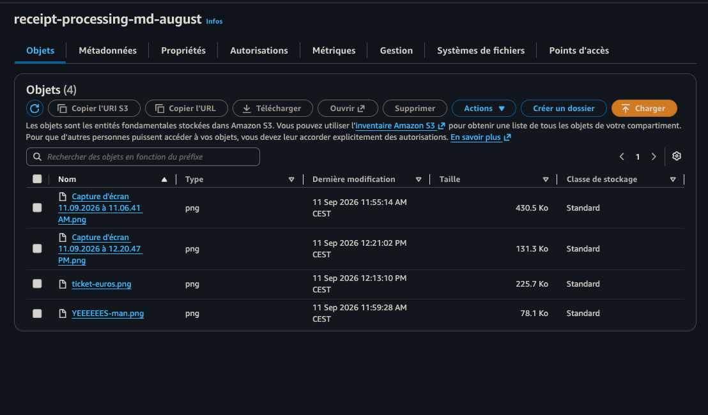
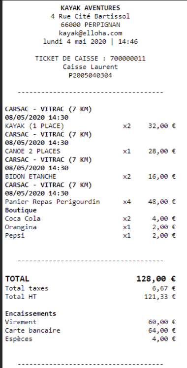
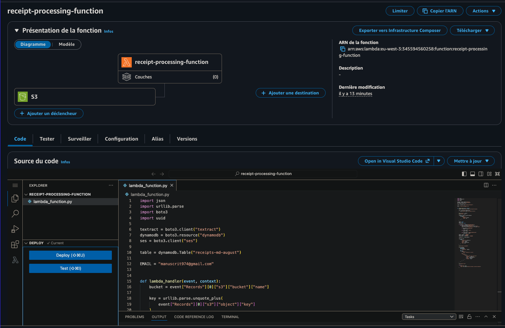
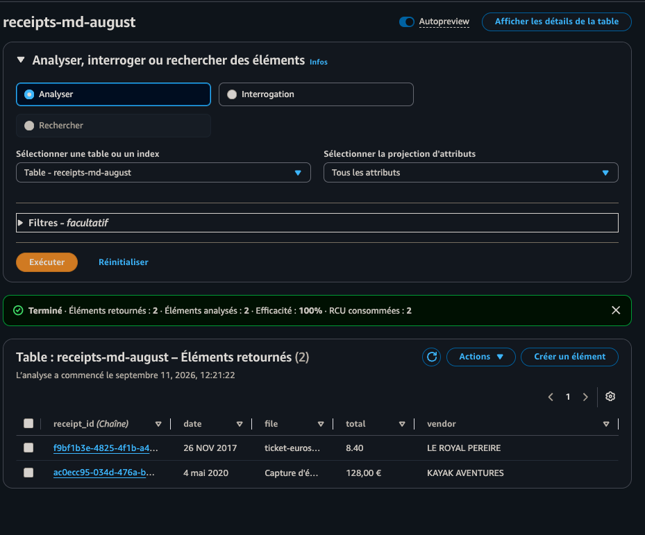
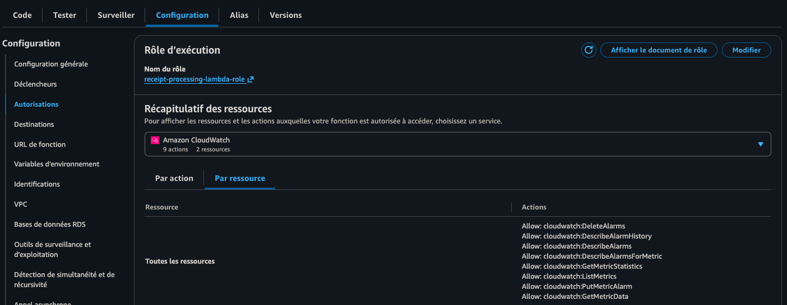
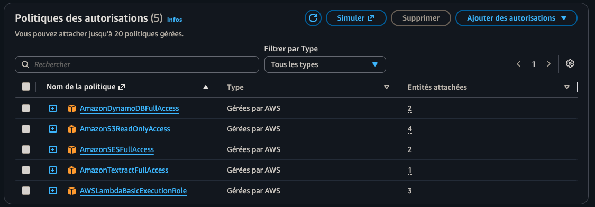
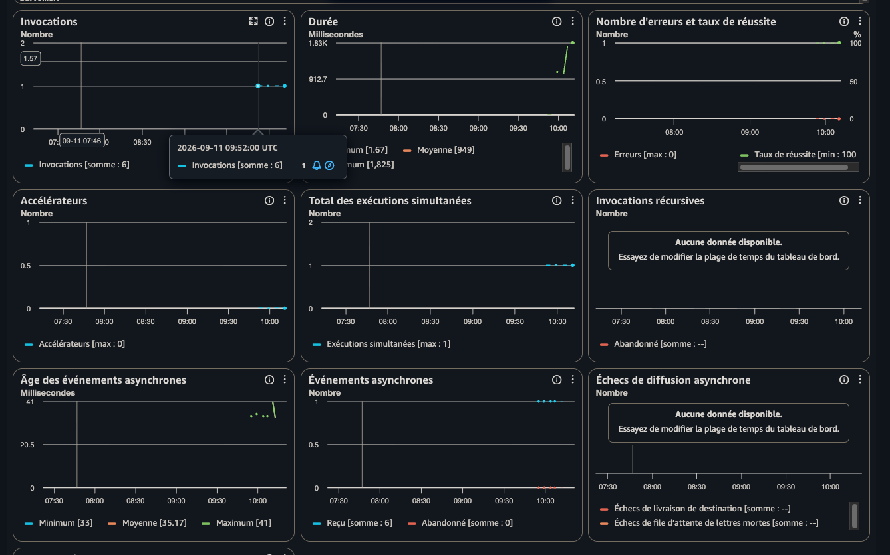

# Traitement automatisé de tickets de caisse avec AWS et Terraform

Ce projet reproduit, en **Infrastructure as Code avec Terraform**, une architecture serverless AWS permettant d'extraire automatiquement les informations importantes d'un ticket de caisse à partir d'une image ou d'un PDF.

Lorsqu'un fichier est envoyé dans **Amazon S3**, une fonction **AWS Lambda** est automatiquement déclenchée. Elle utilise **Amazon Textract** pour analyser le ticket, enregistre les informations extraites dans **Amazon DynamoDB**, puis envoie un récapitulatif par email avec **Amazon SES**.

Les logs et les métriques d'exécution sont disponibles dans **Amazon CloudWatch**.

Le traitement suit donc les étapes suivantes :

1. un ticket est déposé dans le bucket S3 ;
2. S3 déclenche automatiquement la fonction Lambda ;
3. Lambda récupère le fichier ;
4. Amazon Textract analyse le document avec `AnalyzeExpense` ;
5. Lambda extrait notamment le vendeur, la date et le montant total ;
6. les informations sont enregistrées dans DynamoDB ;
7. un email récapitulatif est envoyé avec Amazon SES ;
8. CloudWatch conserve les logs et métriques d'exécution.

---

# Architecture


# Services utilisés

- **Amazon S3** : stockage des images et PDF des tickets
- **AWS Lambda** : orchestration automatique du traitement
- **Amazon Textract** : extraction des informations du ticket
- **Amazon DynamoDB** : stockage des résultats
- **Amazon SES** : envoi du résultat par email
- **Amazon CloudWatch** : logs et métriques de la Lambda
- **AWS IAM** : gestion des permissions de la fonction Lambda
- **Terraform** : déploiement de l'infrastructure

---

# Structure du projet

```text
receipt-processing/
├── README.md
├── .gitignore
├── .terraform.lock.hcl
├── versions.tf
├── provider.tf
├── variables.tf
├── main.tf
├── iam.tf
├── lambda.tf
├── outputs.tf
├── terraform.tfvars.example
├── lambda_function.py
│
└── 
    └── images/
        ├── architecture-diagram.png
        ├── receipt-ticket-euros.png
        ├── receipt-royal-pereire.png
        ├── s3-bucket.png
        ├── lambda-function.png
        ├── lambda-permissions.png
        ├── iam-policies.png
        ├── dynamodb-results.png
        └── cloudwatch-metrics.png
```

---

# Détail des composants

## 1. Stockage des tickets dans Amazon S3

Le projet crée un bucket S3 dédié au stockage des tickets de caisse.

Chaque image ou fichier PDF envoyé dans ce bucket génère un événement `ObjectCreated` qui déclenche automatiquement la fonction Lambda.

Le bucket est privé et les accès publics sont bloqués.

Terraform active également :

- le versioning S3 ;
- une règle de cycle de vie ;
- la suppression automatique des anciens tickets après une durée configurable.

Exemple du bucket contenant plusieurs tickets :



Les fichiers testés dans ce projet comprennent notamment plusieurs captures de tickets ainsi que `ticket-euros.png`.

---

## 2. Exemple de ticket traité

Voici un exemple de ticket utilisé pour tester le pipeline :


Amazon Textract est capable d'extraire automatiquement les informations structurées présentes sur ce type de document.

Dans cet exemple, on retrouve notamment :

```text
Vendor : LE ROYAL PEREIRE
Date   : 26 NOV 2017
Total  : 8.40
```

Un second exemple utilisé pendant les tests :



Il contient notamment :

```text
Vendor : KAYAK AVENTURES
Date   : 4 mai 2020
Total  : 128,00 €
```

---

## 3. Fonction AWS Lambda

La fonction :

```text
receipt-processing-function
```

est automatiquement déclenchée par Amazon S3 lorsqu'un nouveau fichier est ajouté au bucket.



Le code Python se trouve dans :

```text
lambda_function.py
```

La fonction récupère les informations de l'événement S3 :

```python
bucket = record["s3"]["bucket"]["name"]
key = urllib.parse.unquote_plus(
    record["s3"]["object"]["key"]
)
```

Elle appelle ensuite Amazon Textract avec :

```python
textract.analyze_expense(
    Document={
        "S3Object": {
            "Bucket": bucket,
            "Name": key
        }
    }
)
```

La Lambda parcourt tous les éléments présents dans :

```python
event["Records"]
```

afin de pouvoir traiter plusieurs événements dans une même invocation.

---

## 4. Extraction avec Amazon Textract

Le service utilisé pour analyser les tickets est :

```text
Amazon Textract AnalyzeExpense
```

Contrairement à une simple reconnaissance OCR, `AnalyzeExpense` est conçu pour reconnaître les champs présents sur des factures et tickets de caisse.

Le code recherche notamment :

```text
VENDOR_NAME
INVOICE_RECEIPT_DATE
TOTAL
```

Les informations extraites sont ensuite normalisées pour produire des données simples :

```text
vendor
date
total
file
```

Par exemple :

```text
vendor : LE ROYAL PEREIRE
date   : 26 NOV 2017
total  : 8.40
file   : ticket-euros.png
```

---

## 5. Stockage des résultats dans DynamoDB

Les informations extraites par Textract sont enregistrées dans la table :

```text
receipts-md-august
```

Chaque ticket reçoit un identifiant unique :

```text
receipt_id
```

généré avec UUID.

La structure d'un élément est similaire à :

```text
receipt_id
vendor
date
total
file
```

Exemple dans DynamoDB :



On retrouve par exemple :


| vendor           | date        | total    |
| ---------------- | ----------- | -------- |
| LE ROYAL PEREIRE | 26 NOV 2017 | 8.40     |
| KAYAK AVENTURES  | 4 mai 2020  | 128,00 € |


Le mode de facturation DynamoDB utilisé est **On-Demand**, ce qui évite de réserver une capacité fixe pour un petit projet.

Terraform active également le **Point-in-Time Recovery** afin de pouvoir restaurer la table en cas de suppression ou modification accidentelle.

---

## 6. Envoi du résultat avec Amazon SES

Une fois les informations enregistrées dans DynamoDB, Lambda utilise **Amazon SES** pour envoyer un email récapitulatif.

Le message ressemble à :

```text
Reçu traité avec succès

Vendeur : LE ROYAL PEREIRE
Date : 26 NOV 2017
Total : 8.40
Fichier : ticket-euros.png
```

L'identité email SES utilisée par le projet est définie avec la variable Terraform :

```hcl
ses_email = "your-email@example.com"
```

Après le premier `terraform apply`, AWS envoie un email contenant un lien de vérification.

L'adresse doit être vérifiée avant que Lambda puisse envoyer les messages.

> Si SES est encore en mode sandbox, les adresses utilisées comme expéditeur et destinataire doivent être vérifiées.

---

## 7. IAM et permissions Lambda

La fonction Lambda utilise un rôle IAM dédié :

```text
receipt-processing-lambda-role
```



La version Terraform applique des permissions limitées aux ressources nécessaires au projet.

La Lambda est autorisée à :

```text
S3
 └── s3:GetObject

Textract
 └── textract:AnalyzeExpense

DynamoDB
 └── dynamodb:PutItem

SES
 └── ses:SendEmail
 └── ses:SendRawEmail

CloudWatch Logs
 ├── logs:CreateLogGroup
 ├── logs:CreateLogStream
 └── logs:PutLogEvents
```

Les permissions SES sont limitées à l'identité SES configurée par le projet au lieu d'utiliser :

```text
Resource = "*"
```

### Version initiale

La première version réalisée manuellement utilisait plusieurs politiques AWS gérées :



Par exemple :

```text
AmazonDynamoDBFullAccess
AmazonS3ReadOnlyAccess
AmazonSESFullAccess
AmazonTextractFullAccess
AWSLambdaBasicExecutionRole
```

Cette configuration est pratique pour un premier laboratoire, mais elle donne plus de permissions que nécessaire.

La version Terraform applique donc une politique plus restrictive suivant le principe du **least privilege**.

---

## 8. Logs et métriques CloudWatch

Toutes les exécutions de Lambda peuvent être surveillées depuis Amazon CloudWatch.



Les métriques permettent notamment de visualiser :

```text
Invocations
Duration
Errors
Success rate
Concurrent executions
Async events
```

Lors des tests présentés ici, les invocations se terminent avec un taux de succès de 100 %.

Les logs applicatifs contiennent également des informations comme :

```text
Bucket: ...
File: ...

=== RECEIPT DATA ===
Vendor: ...
Date: ...
Total: ...

Saved to DynamoDB
Email sent
```

Terraform crée explicitement le groupe de logs CloudWatch avec une durée de rétention configurable.

Par défaut :

```hcl
log_retention_days = 30
```

Cela évite de conserver les logs indéfiniment.

---

# Correspondance Terraform ↔ AWS


| Fichier Terraform           | Ressources / rôle                                |
| --------------------------- | ------------------------------------------------ |
| `provider.tf`               | configuration du provider AWS et tags par défaut |
| `variables.tf`              | variables du projet                              |
| `main.tf`                   | S3, DynamoDB et ressources principales           |
| `iam.tf`                    | rôle et politique IAM de Lambda                  |
| `lambda.tf`                 | fonction Lambda et déclencheur S3                |
| `outputs.tf`                | noms et informations utiles après déploiement    |
| `lambda/lambda_function.py` | traitement du ticket                             |
| `terraform.tfvars`          | valeurs propres au déploiement                   |


---

# Déploiement

## 1. Initialiser Terraform

```bash
terraform init
```

---

## 2. Vérifier la configuration

```bash
terraform fmt -recursive
terraform validate
```

---

## 3. Examiner le plan

```bash
terraform plan
```

Il est important de lire le plan avant de créer les ressources.

---

## 4. Déployer

```bash
terraform apply
```

Puis confirmez avec :

```text
yes
```

Terraform crée notamment :

```text
S3 bucket
    |
    +--> S3 notification
            |
            v
         Lambda
          / | \
         /  |  \
        v   v   v
 Textract DynamoDB SES
        |
        v
   CloudWatch Logs
```

---

# Vérification de SES

Après le déploiement, Amazon SES envoie un email de vérification à l'adresse configurée dans :

```hcl
ses_email
```

Ouvrez cet email et cliquez sur le lien fourni par AWS.

L'identité doit être vérifiée avant de tester l'envoi d'emails.

---

# Tester le pipeline

Récupérez le nom du bucket :

```bash
terraform output -raw s3_bucket_name
```

Puis envoyez un ticket :

```bash
aws s3 cp ticket-euros.png \
  s3://$(terraform output -raw s3_bucket_name)/ticket-euros.png
```

Le simple upload du fichier déclenche automatiquement la suite du pipeline.

```text
aws s3 cp
    |
    v
S3
    |
    v
Lambda
    |
    v
Textract
    |
    +------> DynamoDB
    |
    +------> SES
    |
    +------> CloudWatch
```

---

# Vérifier DynamoDB

Récupérez le nom de la table :

```bash
terraform output -raw dynamodb_table_name
```

Puis ouvrez DynamoDB dans la console AWS.

Après traitement, un élément similaire doit apparaître :

```text
receipt_id : ac0ecc95-034d-476a-...
date       : 4 mai 2020
file       : ticket-euros.png
total      : 128,00 €
vendor     : KAYAK AVENTURES
```

---

# Sécurité

Le projet applique plusieurs bonnes pratiques.

### S3

Le bucket :

- est privé ;
- bloque les accès publics ;
- utilise le versioning ;
- applique une règle de cycle de vie.

### IAM

La Lambda possède uniquement les permissions nécessaires à son fonctionnement.

### DynamoDB

Le Point-in-Time Recovery est activé.

### CloudWatch

Une politique de rétention empêche l'accumulation indéfinie des logs.

### SES

La permission d'envoi est limitée à l'identité SES configurée.

---

# Gestion du cycle de vie des tickets

La variable :

```hcl
receipt_retention_days
```

permet de déterminer combien de temps les tickets sont conservés dans S3.

La valeur par défaut peut par exemple être :

```hcl
receipt_retention_days = 365
```

Les anciens documents sont alors automatiquement supprimés par la règle de lifecycle S3.

---

### AccessDenied

Un message `AccessDeniedException` indique généralement qu'une action AWS utilisée par la Lambda n'est pas présente dans sa politique IAM.

Consultez les logs CloudWatch pour identifier l'appel concerné.

---

# Nettoyage des ressources

Lorsque le projet n'est plus nécessaire :

```bash
terraform destroy
```

Le bucket S3 doit être vide pour pouvoir être supprimé.

Supprimez donc les fichiers avant le `destroy` si nécessaire :

```bash
aws s3 rm \
  s3://$(terraform output -raw s3_bucket_name) \
  --recursive
```

Puis :

```bash
terraform destroy
```

---

# Résultat

Le projet permet de passer automatiquement :

```text
                 ticket-euros.png
                        |
                        v
                       S3
                        |
                        v
                     Lambda
                        |
                        v
                    Textract
                        |
            +-----------+-----------+
            |                       |
            v                       v
        DynamoDB                    SES
            |                       |
            v                       v
vendeur / date / total       email récapitulatif

                        +
                        |
                        v
                   CloudWatch
```

Un simple upload d'un ticket suffit donc à déclencher l'ensemble du traitement sans serveur à administrer.